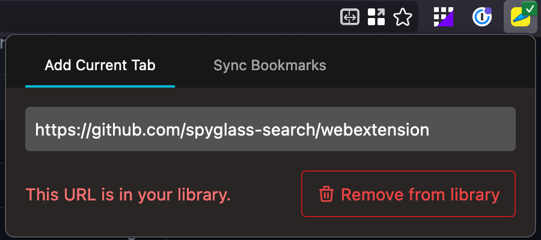

# Indexing bookmarks

Indexing bookmarks & adding pages from the browser requires the Spyglass web extension:

- [Install in Chrome](https://chrome.google.com/webstore/detail/spyglass-search/afhfiojklacoieoanfabefpfngphkmml)
- [Install in Firefox](https://addons.mozilla.org/en-US/firefox/addon/spyglass/)

## Add a single page to your index

If you want to add a single page to Spyglass without bookmarking it in your browser,
you can easily do this by navigating to the Spyglass icon & clicking "Add to Spyglass".

    

Once added or if you've already added a page, you can check the status & remove from your
library.

    

## Syncing your bookmarks

Start by toggling the sync button in the "Sync Bookmarks" tab. This will grab all
your bookmarks from the browser and send them to be crawled by Spyglass.

    

