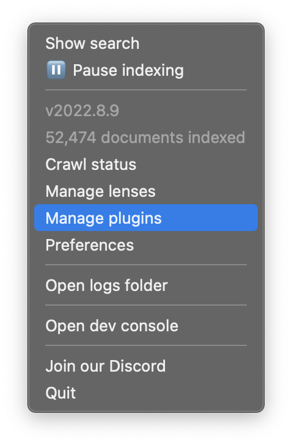
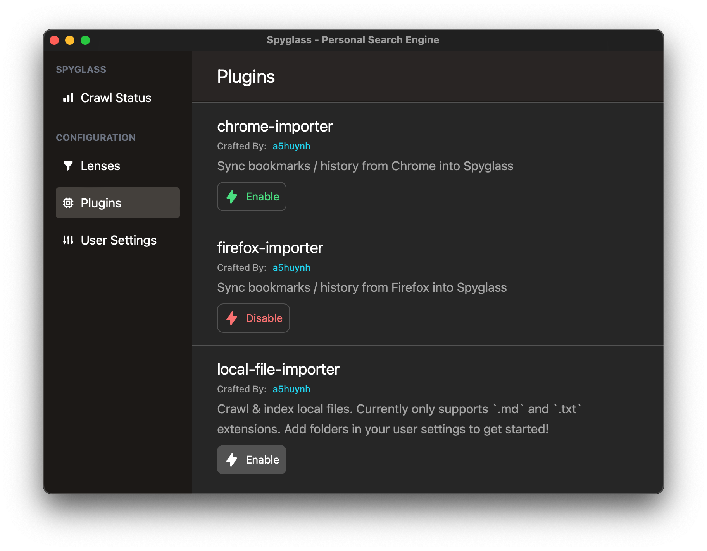
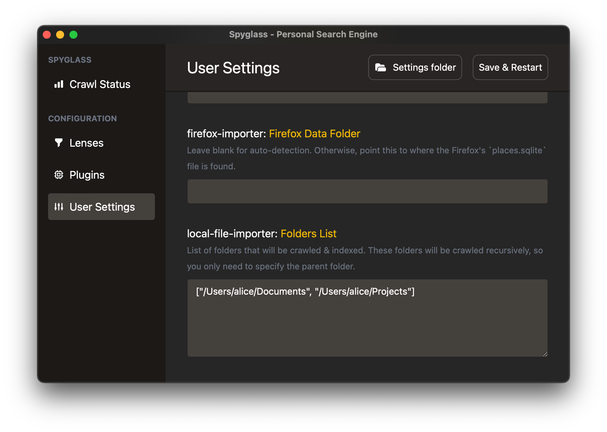

# Indexing bookmarks

> NOTE: Currently bookmark syncing only works w/ Chrome and Firefox. If you'd like us
> to support other services, please let us know!

## Enabling the plugin for your browser

The browser plugins are disabled by default. Navigate to the
"Manage Plugins" item in the menubar dropdown to open up the plugin
management interface.

    

Click on the "Enable" button under the "local-file-indexer" plugin to enable local
file indexing.

    

## Adding folders to index

The file indexer plugin will recursively walk through a folder & its' children to
find files. Because of this, you'll only need to add the parent folder of
what you want to index.

For example, if you want to index all the files under `/Users/alice/Documents/projects`
and `/Users/alice/Documents/Obsidian Notes`, you only need to add `/Users/alice/Documents`.

To add folders, navigate to the "User Settings" and scroll down to the `local-file-importer: Folders List`
setting. This takes an array of folder strings as seen below:

    

The list will be validated and an error will pop up if the folder does not exist.