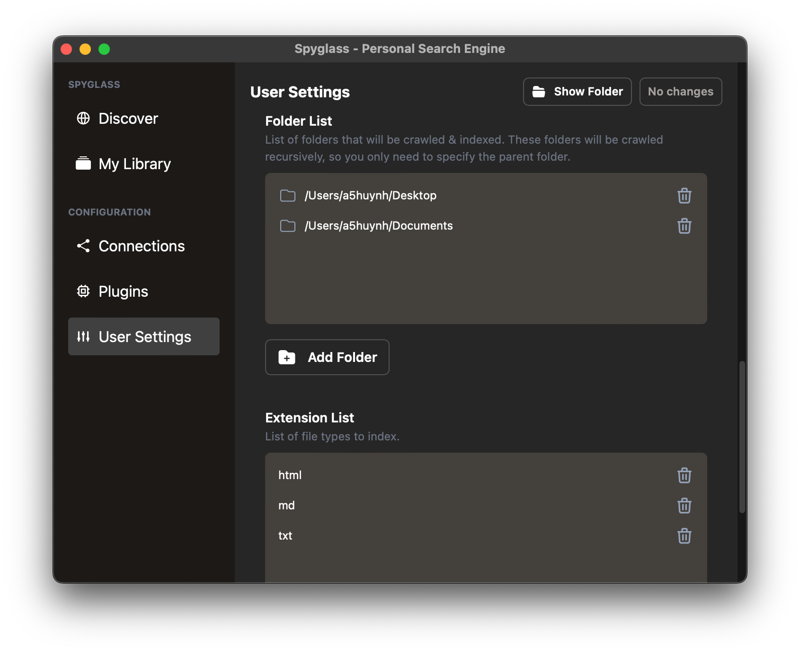

# Indexing local files

As you're onbarding you'll see the ability to enable local file searching and audio
content indexing as seen below.

    

## File Searching

Local file search will, by default, start with your Desktop and your Documents folder.
You can add additional folders in your user settings.

### Supported File Formats

Code file supported is rudimentary and things like symbols / class names / function
names are not yet taken into account.

**Code files:**
- `c`, `cpp`
- `js`, `ts`
- `rs`

Configuration / text files are treated as standard text & automatically indexed
and searchable.

**Config/Text files:**
- `cfg`
- `csv`
- `md`
- `toml`
- `txt`
- `yaml`, `yml`

Word documents, spreadsheets, and PDFs are also handled automatically their content
immediately searchable.

**Supported document formats:**
- `docx`, `ods`
- `xls`, `xlsx`
- `pdf`

Additional extensions that you'd like to have indexed can be added through the
user settings.

### Audio Search

If enabled, audio search will automatically transcribe audio from any audio/video
file. This is especially handy if you have saved Zoom meetings, audiobooks, or even
YouTube content that you'd like to search through!

Supported formats:
- `aac`
- `avi`
- `flac`
- `m4a`
- `mp3` & `mp4`
- `ogg`
- `wav`
- `webm`

## Adding folders to index

The file indexer plugin will recursively walk through a folder & its' children to
find files. Because of this, you'll only need to add the parent folder of
what you want to index.

For example, if you want to index all the files under `/Users/alice/notes/personal`
and `/Users/alice/notes/work`, you only need to add `/Users/alice/notes`.

To add folders, navigate to the "User Settings" and scroll down to the `Folder List`
setting. This takes an array of folder strings as seen below:

    

Click the "Add Folder" button to choose a folder to add, save your changes, and Spyglass
will start indexing the contents immediately!