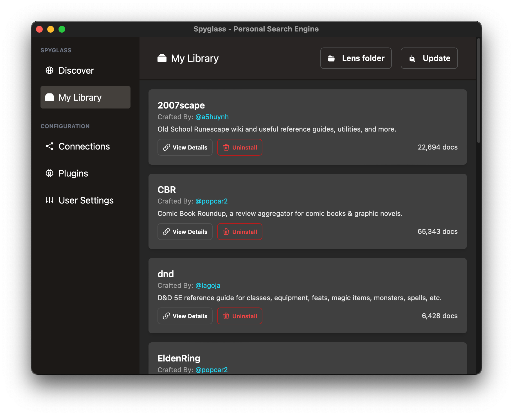

# Lenses

Spyglass expands on the ideas outlined in [this paper][googles-paper] by the
Brave Search Team to allow users to define what should / should not be crawled
and indexed for topics they're interested in.

[googles-paper]: https://brave.com/static-assets/files/goggles.pdf

## Managing your library

Open the "My Library" window bygoing into the system tray menu and clicking on
the `My Library` option. This will open a window like below:

    

Here you can view the progress of any crawls or lenses being installed. `View Details`
will bring up the source code for the lens configuration.